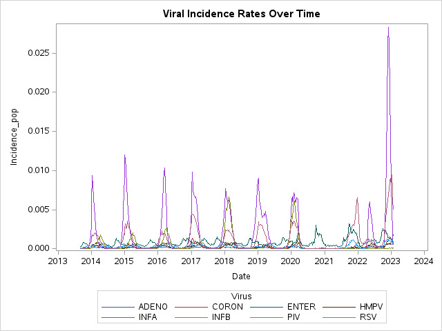

Analysis of respiratory virus infections in Canada using `SAS` and `saspy`.

# Included Virus
- `ADENO`: adeno virus
- `CORON`: human coronaviruses
- `ENTERORHINO`: entero rhinovirus
- `HMPV`: human metapneumovirus
- `INFA`: influenza A
- `INFB`: influenza B
- `RSV`: respiratory syncitial virus
- `PIV`: parainfluenzavirus

# Snippet
```sas
TITLE 'Viral Incidence Rates Over Time';
PROC SGPLOT DATA=work.mydata;
    SERIES x=date y=Incidence_pop / GROUP=Virus;
RUN; 
```


# Data Citation
Varela-Lasheras I, Perfeito L, Mesquita S, Gonc¸alves-Sa´ J (2023) The effects of weather and mobility on respiratory viruses dynamics before and during the COVID-19 pandemic in the USA and Canada. PLOS Digit Health 2(12): e0000405. https://doi.org/10.1371/journal.pdig.0000405